@@@
Title=HTB: Nibbles
Description=This is HTB Nibbles
@@@

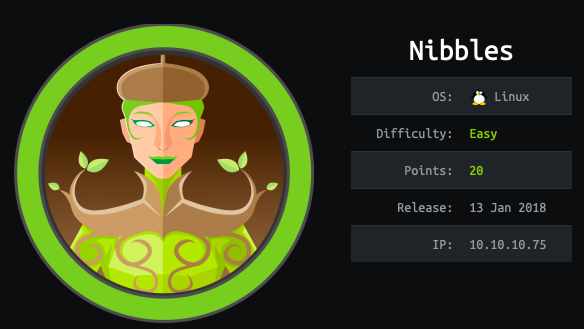

Nibbles is an Easy Linux Hack The Box machine. It was released 13 January 2018 and has been retired for some time. I am following TJNull's OSCP preparation guide which Nibbles is a part of. This is box one of this list. I will be doing all of the boxes and posting my write ups here. Nibbles box was a relatively straight forward Linux box. 

# Recon to User

## NMap Scan
We start by running a full port scan with service version enumeration.

~~~	
nmap -p- -sV 10.10.10.75
~~~

Once this scan comes back we see that there are two open ports. 

* 22/tcp OpenSSH 7.2p2
* 80/tcp Apache httpd 2.4.18

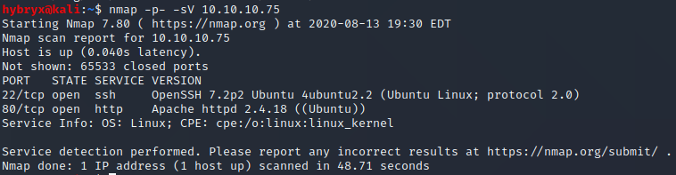

## Searchsploit
We see two services open, I don't think that they are vulnerable but we can check anyways. We did not find anything of note in the searchsploit searches. 

## Dirb Scan of Port 80
Anytime we see an open HTTP port we immediately start a Dirb scan. I always run Dirb with the big.txt word list. It is located at */usr/share/wordlists/dirb/big.txt*. As we can see, there were not many directories or pages found. 

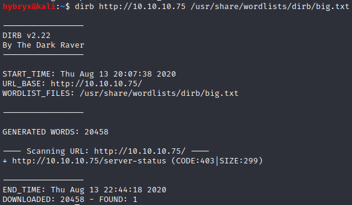

## Visit Web Browser

Visiting the web browser we don't see much other than some Hello World! code. 

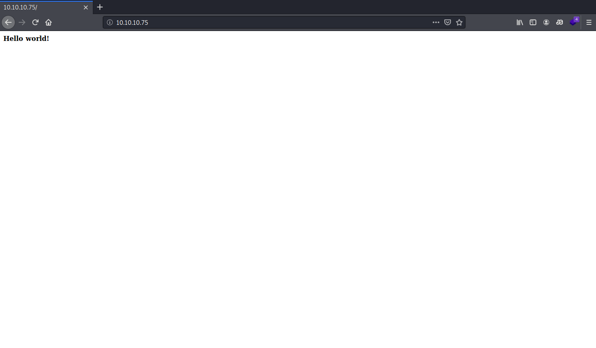

Since OpenSSH seems to be a dead end from our searchsploit results, and the dirb scan did not return any meaningful results, we will inspect element of this web page to see if there is any information. 

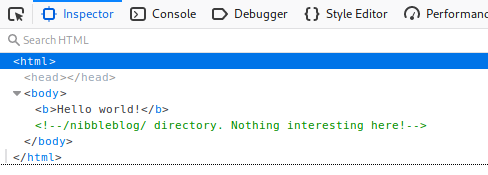

## Nibbleblog Web Page
Immediately we see a comment that says "/nibbleblog/ directory". This tells us that there is most likely a directory of the web server called *nibbleblog*. If we go to that extension we will see the following blog site. 

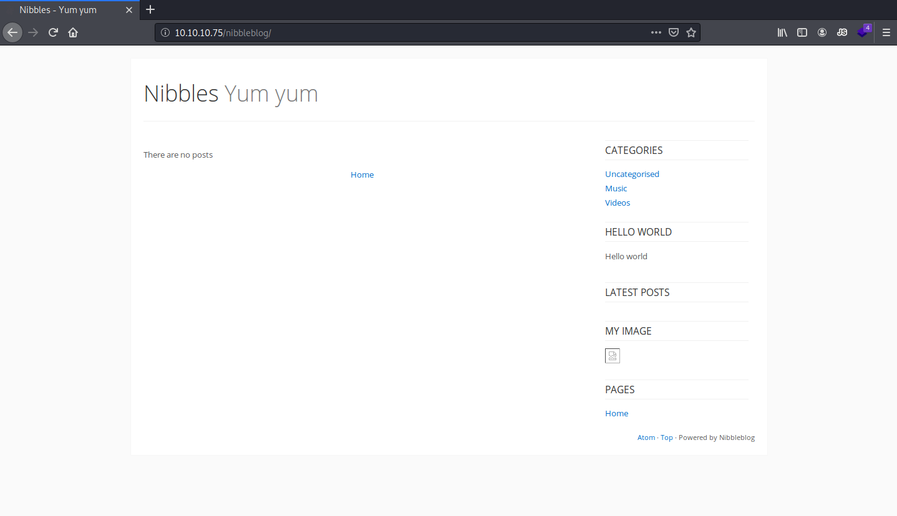

We start another Dirb scan for this level of the web page.

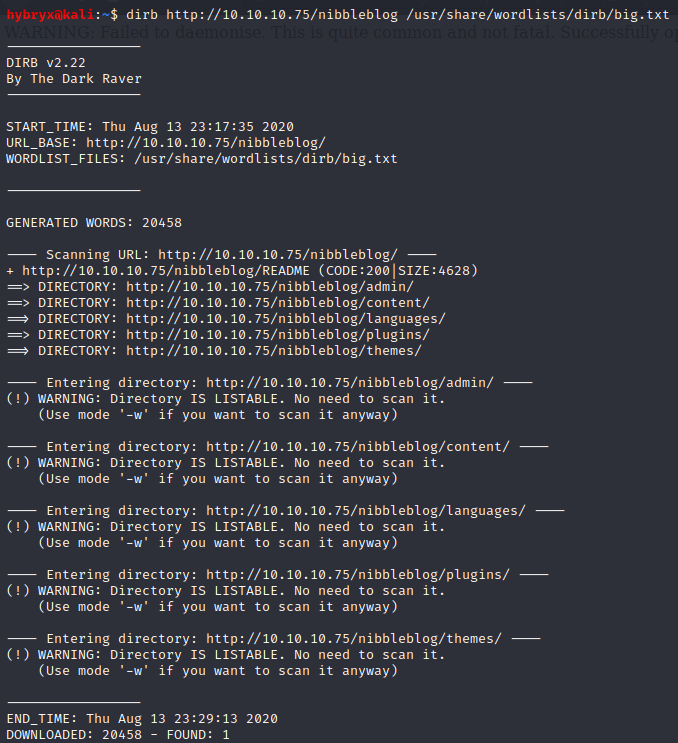

If we look in the bottom right corner it says "Powered by Nibbleblog".
We can look for Nibbleblog exploits using searchsploit now that we know what is running on the back end of this site. 

We see a SQL injection but I was unable to get this to work. We also see a Metasploit module. We will skip this in pursuit of OSCP. 

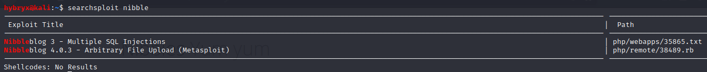

## Nibbleblog Exploit
We will search on line for Nibbleblog exploits. We find this site <https://wikihak.com/how-to-upload-a-shell-in-nibbleblog-4-0-3/> which explains how to upload a reverse shell. 

The guide tells us to visit */nibbleblog/admin.php?controller=plugins&action=install&plugin=my_image* to upload a php reverse shell. Once we visit this on the target machine we see the following. 

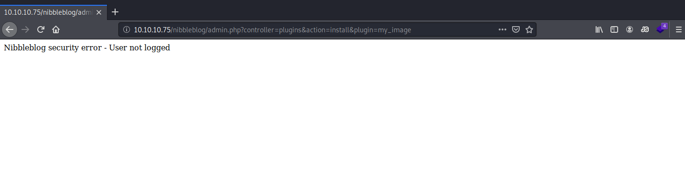

This says that we need to login. Since this is a php page, if we remove all the parameters after the "?" we will access the base php page, hopefully resulting in a login page. 

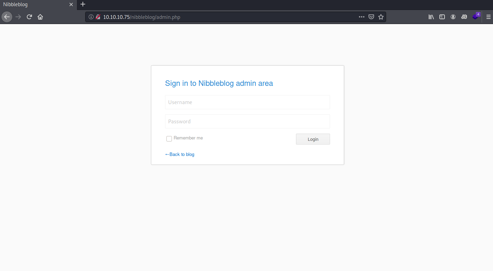

We are correct in our assumption. Whenever we encounter a login page, we first start by trying default or common credentials. If these do not work, we can escalate our attempts to a more invasive attack. After trying some default credentials and patters we are successful with the credentials "admin:nibbles"

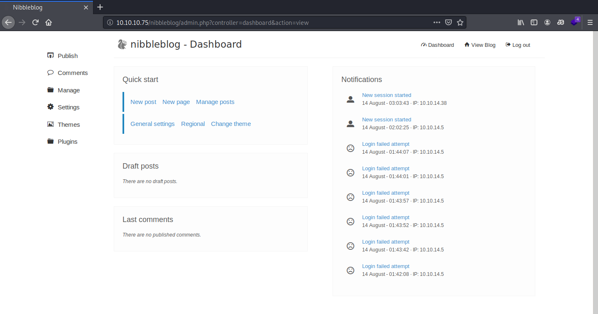

Now we can follow the guide to upload our reverse shell. Click on Plugins on the left navigation bar. Then under My Image, select Configure. Now we will upload a PHP reverse shell. We are using Pentest Monkeys PHP reverse shell. Change the IP and Port in the reverse shell and upload the file. 

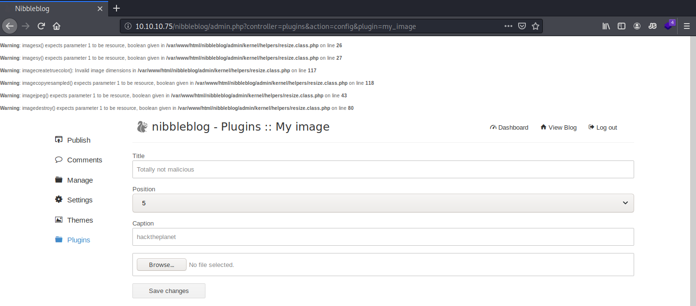

You will see some errors on the screen but these can be ignored. Now we need to navigate to the exposed Apache file structure site. We can see our uploaded reverse shell at *10.10.10.75/nibbleblog/content/private/plugins/my_image/*.

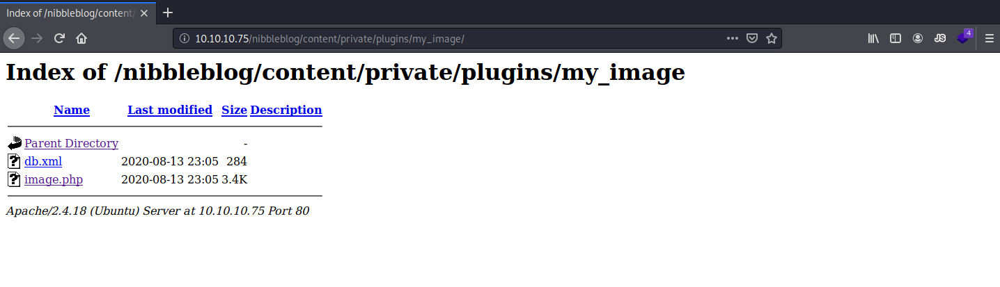

Start our reverse shell listener and select our reverse shell on the web browser and we should receive a shell back. 

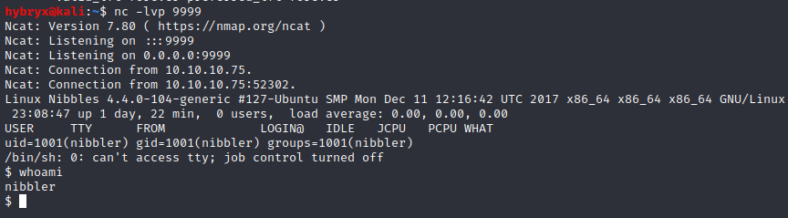

From here, you can grab the user flag. 

# Root

## Getting a Full Shell
Elevate our shell to get a full TTY using Python's tty library. But before we do that we have to see what version of Python is running. We use the *whereis* to help us find the Python binaries. Then we use the tty library to spawn the shell.

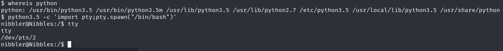

It is always smart to run "sudo -l" first to see if we can run sudo. This takes awhile to respond but eventually it will respond the following. 

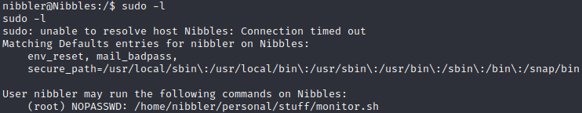

This tells us that we can run sudo without needing a password on the *monitor.sh* file in */home/nibbler/personal/stuff/monitor.sh*. We first check to see what privileges we have on that file. 

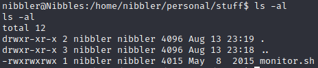

## Editing monitor.sh
We can edit this file! This means that we can run this file as root and we can also control the files contents. I backup this file and create a new file with the same name. It is always a good idea to not change the source integrity of a file if possible. Since we can create files and rename files, we will rename the file. We will still be able to execute the file as we can execute sudo on a specific path. And we will still be executing the file at the end of that path. 

But what should we put into our file to be run as sudo? We could do a number of things but the easiest is to start a bash shell which will inherit the privileges of the calling program which is root. We edit the file to do just that. 

~~~
#!/bin/bash

bash -i
~~~

## Running monitor.sh to Access Root
Once we run this with sudo, we see that we now have a root shell. Not that this took awhile to respond back initially. Just be patient and the shell will pop up eventually. 

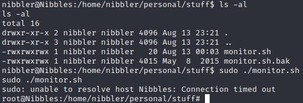

CD to roots directory to grab the root flag. 
